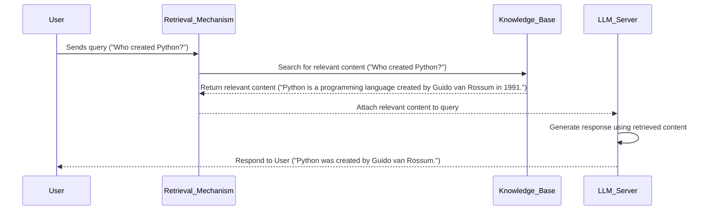

## Prerequisites

Sometimes, I doubt if explicitly stating the prerequisites makes really sense. Thus, no bullet points in this section. Nevertheless, this article deals with Generative AI concepts and for the hands-on parts, Python, and basic Linux and CLI experience is needed to follow through.

## Introduction

Language models, specifically text-to-text ones, take natural language as input and produce plausible natural language that is semantically related to the input. Large Language Models (LLMs) are pre-trained on a large amount of textual data, like the [Common Crawl corpus](https://commoncrawl.org/) or [The Pile](https://pile.eleuther.ai/) and other web resources like Wikipedia, Stack Overflow, etc. Most of LLMs are pre-trained using either the [Casual Language Modeling (CLM)](https://huggingface.co/docs/transformers/en/tasks/language_modeling) technique, see GPT models, or [Masked Language Modeling (MLM)](https://huggingface.co/docs/transformers/en/tasks/masked_language_modeling), see BERT. In CLM, the task of training is to predict the next most probable token (or array of tokens) in a sequence of tokens, e.g.

```bash
User query: The easiest way to fry an egg is ___
LLM response: to crack it gently into a hot, non-stick pan.
```

In MLM, the task is to predict a masked token in a sentence, e.g.

```bash
User query: The easiest way to fry an egg is to ___ it gently into a hot, non-stick pan.
LLM response: crack
```

Both CLM, and MLM, enable a model to acquire general knowledge and language understanding. Thus, those [widely known LLMs](https://huggingface.co/spaces/lmarena-ai/chatbot-arena-leaderboard), such as the GPT-4.5, Gemini-2.0, Claude 3.7 Sonnet, etc can be used off-the-shelf for various applications such as text summarisation, word/sentence autocomplete, sentiment analysis, etc. Nevertheless, in various situations the use of pre-trained models does not suffice. Such cases are when a task requires higher accuracy, when a thorough understanding of the context (domain-specific) is necessary, when proprietary datasets must remain private, or when up-to-date information is crucial.[^1] In these circumstances, fine-tuning and Retrieval-Augmented Generation (RAG) techniques are implemented.[^2] They both use a pre-trained LLM as a foundation. However, fine-tuning methods further re-train the foundation model and thus further adapt a handful of model parameters on domain-specific tasks. While, in RAG the LLM is inferred with prompts that carry along the actual user input with fresh external knowledge. These techniques, fine-tuning and RAG, serve different purposes and use cases. A post-training method must be carefully chosen since it greatly affects the overall design of Generative AI systems. For instance, compute resources, security and data privacy, evolving content, as well as the costs related to the building and maintenance are some factors of vital importance when picking up a post-training method.[^3]

## RAG Basic Principles

In this article, the basics of RAG are examined solely, ignoring fine-tuning. The intention here is not to demonstrate a complicated RAG architecture and display dozens of inter-connected components like tokenisation, vectorisation, indexing, vector storage, etc. This article aims to enable the reader to comprehend the fundamentals of RAG in theory and practice.

First, let us define RAG or better say a Generative AI system that implements RAG. In principle, such a system can be composed into three main parts, the user, an external knowledge base, and the LLM server. The user sends a query to the server, e.g. `Who created Python?`. Subsequently, the query is redirected to a retrieval mechanism that checks for relevant content to this query into the external database based on some similarity measure. For example, assume that the external database is an array of factual sentences, and that the retrieval mechanism returns `Python is a programming language created by Guido van Rossum in 1991.` as the most relevant out of all. Then, the initial user query is augmented with the retrieved content and are both sent together to the LLM server. Finally, the LLM responds to the user with something like `Python was created by Guido van Rossum`. The LLM instead of generating an answer that comes from its training data will first look for an answer to the relevant content.



RAG is a great method for creating Generative AI systems when fine-tuning is too expensive or due to limited computational resources or lack of labeled data, as well as when the task at hand requires a constantly up-to-date information such as news, real-time Q&A etc.[^3]

## References

[^1]: <https://www.acorn.io/resources/learning-center/fine-tuning-llm/>

[^2]: <https://arxiv.org/html/2408.13296v1#Ch1.S5>

[^3]: <https://learn.microsoft.com/en-us/azure/developer/ai/augment-llm-rag-fine-tuning>
