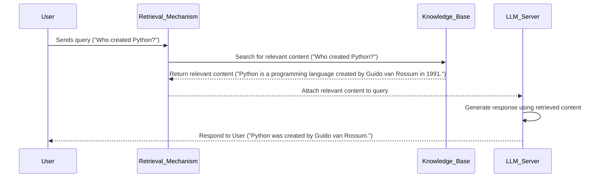

## Prerequisites

Sometimes, I doubt if explicitly stating the prerequisites makes really sense. Thus, no bullet points in this section. Nevertheless, this article deals with Generative AI concepts and for the hands-on parts, Python, and basic Linux and CLI experience is needed to follow through.

## Introduction

Language models, specifically text-to-text ones, take natural language as input and produce plausible natural language that is semantically related to the input. Large Language Models (LLMs) are pre-trained on a large amount of textual data, like the [Common Crawl corpus](https://commoncrawl.org/) or [The Pile](https://pile.eleuther.ai/) and other web resources like Wikipedia, Stack Overflow, etc. Most of LLMs are pre-trained using either the [Casual Language Modeling (CLM)](https://huggingface.co/docs/transformers/en/tasks/language_modeling) technique, see GPT models, or [Masked Language Modeling (MLM)](https://huggingface.co/docs/transformers/en/tasks/masked_language_modeling), see BERT. In CLM, the task of training is to predict the next most probable token (or array of tokens) in a sequence of tokens, e.g.

```bash
User query: The easiest way to fry an egg is ___
LLM response: to crack it gently into a hot, non-stick pan.
```

In MLM, the task is to predict a masked token in a sentence, e.g.

```bash
User query: The easiest way to fry an egg is to ___ it gently into a hot, non-stick pan.
LLM response: crack
```

Both CLM, and MLM, enable a model to acquire general knowledge and language understanding. Thus, those [widely known LLMs](https://huggingface.co/spaces/lmarena-ai/chatbot-arena-leaderboard), such as the GPT-4.5, Gemini-2.0, Claude 3.7 Sonnet, etc can be used off-the-shelf for various applications such as text summarisation, word/sentence autocomplete, sentiment analysis, etc. Nevertheless, in various situations the use of pre-trained models does not suffice. Such cases are when a task requires higher accuracy, when a thorough understanding of the context (domain-specific) is necessary, when proprietary datasets must remain private, or when up-to-date information is crucial.[^1] In these circumstances, fine-tuning and Retrieval-Augmented Generation (RAG) techniques are implemented.[^2] They both use a pre-trained LLM as a foundation. However, fine-tuning methods further re-train the foundation model and thus further adapt a handful of model parameters on domain-specific tasks. While, in RAG the LLM is inferred with prompts that carry along the actual user input with fresh external knowledge. These techniques, fine-tuning and RAG, serve different purposes and use cases. A post-training method must be carefully chosen since it greatly affects the overall design of Generative AI systems. For instance, compute resources, security and data privacy, evolving content, as well as the costs related to the building and maintenance are some factors of vital importance when picking up a post-training method.[^3]

## RAG Basic Principles

In this article, the basics of RAG are examined solely, ignoring fine-tuning. The intention here is not to demonstrate a complicated RAG architecture and display dozens of inter-connected components like tokenisation, vectorisation, indexing, vector storage, etc. This article aims to enable the reader to comprehend the fundamentals of RAG in theory and practice.

First, let us define RAG or better say a Generative AI system that implements RAG. In principle, such a system can be composed into three main parts, the user, an external knowledge base, and the LLM server. The user sends a query to the server, e.g. `Who created Python?`. Subsequently, the query is redirected to a retrieval mechanism that checks for relevant content to this query into the external database based on some similarity measure. For example, assume that the external database is an array of factual sentences, and that the retrieval mechanism returns `Python is a programming language created by Guido van Rossum in 1991.` as the most relevant out of all. Then, the initial user query is augmented with the retrieved content and are both sent together to the LLM server. Finally, the LLM responds to the user with something like `Python was created by Guido van Rossum`. The LLM instead of generating an answer that comes from its training data will first look for an answer to the relevant content.



RAG is a great method for creating Generative AI systems when fine-tuning is too expensive or due to limited computational resources or lack of labeled data, as well as when the task at hand requires a constantly up-to-date information such as news, real-time Q&A etc.[^3]

## Reverse Engineering of a Simple RAG System

First, let's define what we want to build. In fact, that's the hardest thing to do in this business. And to be fair, it's harder to rather answer the `why` than the `what`! Yet, let's assume that you would like to build your own personal Python assistant that takes into account your personal notes instead of solely relying on the foundation LLM training data.

As mentioned beforehand, there are three main building blocks for such a system: 1. the user query (rather, the way of ingesting it to the the server), 2. the knowledge base, and 3. the LLM server.

Therefore, the engineering of such a RAG system depends on the way that how to form requests to the LLM server. For this exersice, we chose to work with [Ollama](https://ollama.com/) and thus we need first to examine how to form our request for this particular server. Its installation is fairly simple and the instructions can be found on their [GitHub repository](https://github.com/ollama/ollama). After installing Ollama, we need to verify if it's running properly. You can do that by either visiting `http://127.0.0.1:11434` or executing:

```bash
curl http://localhost:11434/api/version
```

In case of success, you should be seeing something like this in the output:

```bash
StatusCode        : 200
StatusDescription : OK
Content           : {"version":"0.6.2"}
RawContent        : HTTP/1.1 200 OK
                    Content-Length: 19
                    Content-Type: application/json; charset=utf-8
                    Date: Fri, 21 Mar 2025 10:50:34 GMT

                    {"version":"0.6.2"}
Forms             : {}
Headers           : {[Content-Length, 19], [Content-Type, application/json; charset=utf-8], [Date, Fri, 21 Mar 2025 10:50:34 GMT]}
Images            : {}
InputFields       : {}
Links             : {}
ParsedHtml        : mshtml.HTMLDocumentClass
RawContentLength  : 19
```

When you make sure that the Ollama server is up and running, it's time to choose a foundation LLM. For our simple RAG system, most of LLMs would suffice. Nonetheless, I choose to work with Google's open model [Gemma 3](https://ollama.com/library/gemma3:4b). To install it into your Ollama server, go ahead and run the following command.

```bash
ollama pull gemma3:4b
```

Personally, I prefer using [Postman](https://www.postman.com/) to organise and keep track of the various API requests. Moreover, for this work specifically, I have published a short [Postman documentation](https://documenter.getpostman.com/view/21880869/2sAYkGLf4f) of the collection of API requests I've used. There, you can find how to form two API calls, one to verify that the Ollama server is running and another one to infer an LLM. Thus, following the installation of `gemma3:4b`, it's time to infer it with some query and generate a response. As you can follow in the [documentation](https://documenter.getpostman.com/view/21880869/2sAYkGLf4f), you need to send this payload:

Based on the [Ollama API documentation](https://github.com/ollama/ollama/blob/main/docs/api.md)

```json
{
    "model": "gemma3:4b",
    "prompt": "Who created Python (programming language)?",
    "system": "You are a Python expert who replies concisely only on Python related questions in less than 100 words text.",
    "stream": false
}
```

to the `http://localhost:11434/api/generate` endpoint. A successful respond will include a `"response"` value in the return payload.

```json
{
    "model": "gemma3:4b",
    "created_at": "2025-03-17T18:38:30.4516189Z",
    "response": "Guido van Rossum created Python in the late 1980s. He was inspired by ABC, a previous language he worked on, and aimed for readability and a clean syntax.",
    "done": true,
    "done_reason": "stop",
    "context": [
    ],
    "total_duration": 42026347600,
    "load_duration": 26522853800,
    "prompt_eval_count": 43,
    "prompt_eval_duration": 10698000000,
    "eval_count": 40,
    "eval_duration": 4771000000
}
```

The parameters we have included in the message body of the request to the `/api/generate/` endpoint are the `model`, `prompt`, `system`, and `stream`. With `model` we choose the foundation LLM supported by Ollama, `prompt` is the user query to generate a response for, with `system` we defined a very simple system message and with setting `stream` to `false` we chose the response to be returned as a single response object.

Okay so far, we learned how to perform a request to the LLM server. Now, we need to create a knowledge base with fresh information about are domain-specific task.

First let's design our code together. We need to create a knowledge base, we need a method that ingests the user query and checks on the knowledge base for relevant content, this method also needs another method that uses some kind of similarity measure and scores the user query to each entry of the database. Finally we need a method that augments the users input with the relevant content and sends this request to the server.

### Knowledge Base

PAUSED HERE

A knowledge base would usually consist of collection of documents. For this exersice we assume that each document is represented by a string:

```python
knowledge_base = [
 "Python is a programming language created by Guido van Rossum in 1991.",
 "Python is known for its simplicity and readability.",
 "Python supports procedural, object-oriented, and functional programming.",
 "The Python Package Index (PyPI) is the official repository for 3rd-party Python software.",
 "Python uses indentation to define code blocks.",
 "Python is used for developing web applications.",
 "Python can be used for creating machine learning models."
]
```

### Jaccard Similarity

Next, we need to define a similarity measure we are going to use. This stage is critical since and the final server response primarily That is basically a measure that will score each document against the user inputsIt is defined in general taking the ratio of two sizes (areas or volumes), the intersection size divided by the union size, also called intersection over union (IoU).[^4]

$$ J(A,B) = \frac{A}{B} $$

```python
def jaccard_similarity(query: str, document: str) -> float:
    # normalise text
    query = set(query.lower().split(" "))
    document = set(document.lower().split(" "))

    # calculate intersection and union
    intersection = query.intersection(document)
    union = query.union(document)

    return len(intersection)/len(union)
```

### Retrieval mechanism

```python
def retrieve(query: str, external_resources: list) -> str:
    # score docs against query
    similarities = [jaccard_similarity(query, doc) for doc in external_resources]
    # get the index of the maximum similarity
    max_index = similarities.index(max(similarities))
    # return the top matching document
    return external_resources[max_index]
```

### Chat completion

```python
def chat_complete(query: str, external_resources: list, system_prompt: str) -> str:
    server_url = "http://localhost:11434/api/generate"
    retrieved_context = retrieve(query, external_resources)

    augemented_prompt = f"""Based on the following information:
    
    {retrieved_context}

    provide an answer to the following question:

    {query}
    """

    payload = {
    "model": "gemma3:4b",
    "prompt": augemented_prompt,
    "system": system_prompt,
    "stream": False
    }

    headers = {
    'Content-Type': 'application/json'
    }

    response = requests.request("POST", server_url, headers=headers, json=payload, timeout=180)
    response = response.json()

    return response.get("response", None)
```

## References

[^1]: <https://www.acorn.io/resources/learning-center/fine-tuning-llm/>

[^2]: <https://arxiv.org/html/2408.13296v1#Ch1.S5>

[^3]: <https://learn.microsoft.com/en-us/azure/developer/ai/augment-llm-rag-fine-tuning>

[^4]: <https://en.wikipedia.org/wiki/Jaccard_index>
